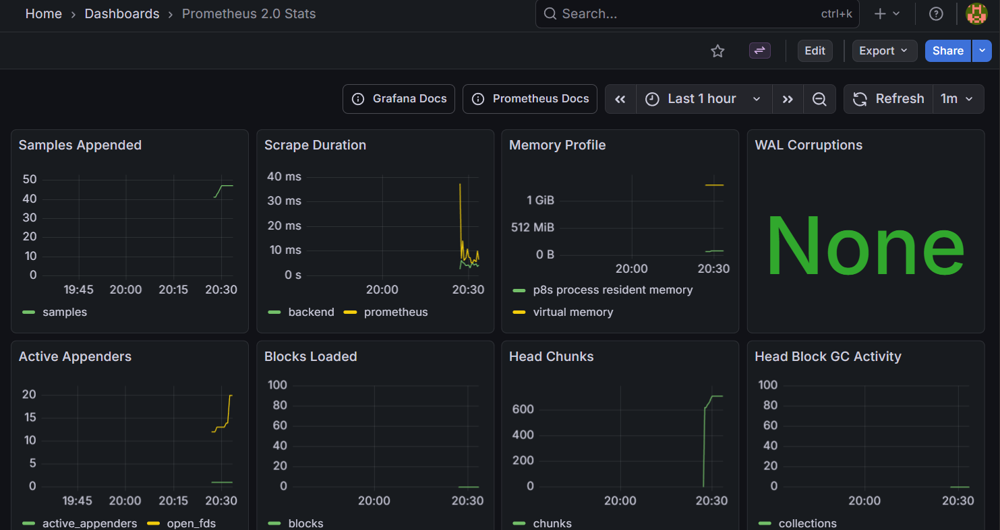
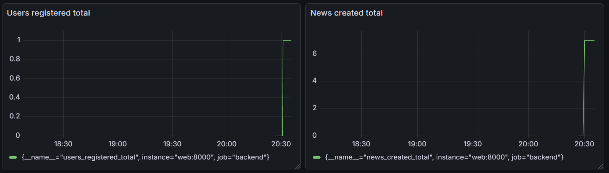
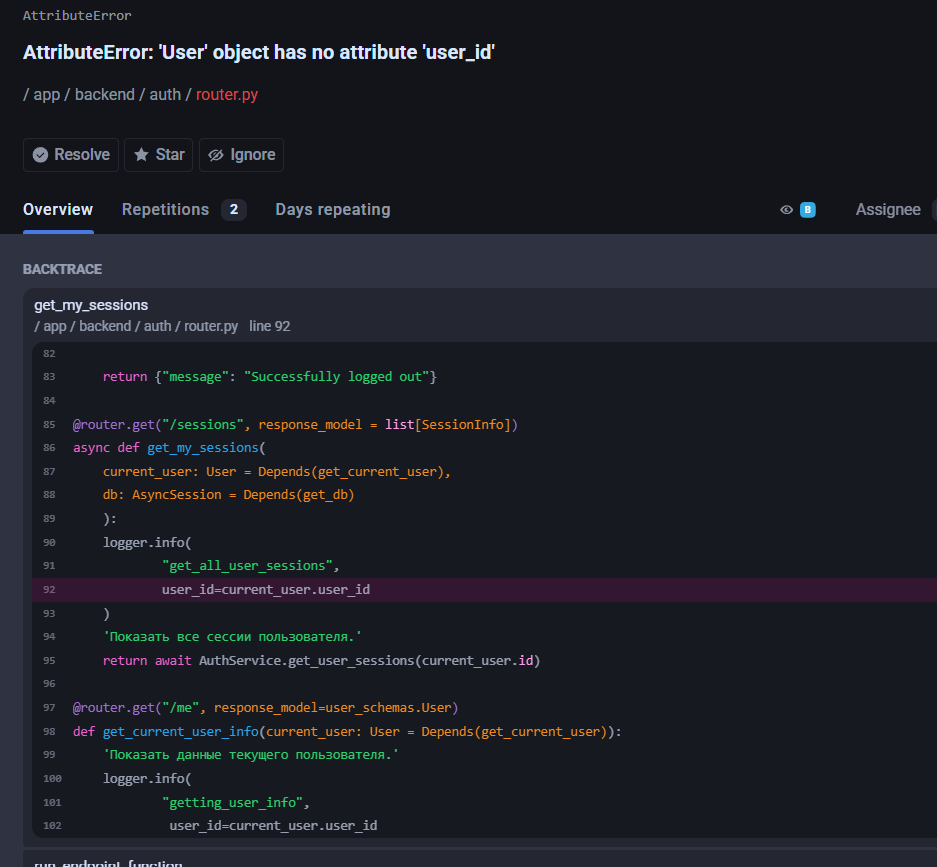

# Запуск

Проект запускается на локальном сервере в контейнере:


```docker-compose up --build```


Для отката на одну миграцию alembic назад надо сначала подключиться к контейнеру:


```docker-compose exec web bash```


Далее прописать:


```alembic downgrade -1```


А для продвижения вперёд:


```alembic upgrade {migration_number: 001}```


Для сворачивания контейнера:


```docker-compose down -v```


# Ручки

## POST-запрос /users
Создание пользователя.

Надо отправить json следующей структуры:

{

  "name": "string",
  
  "email": "EmailStr",
  
  "avatar": "string"
  
}

При попытке ввода некорректный или уже введённый email будет ошибка.
## GET-запрос /users
Просмотр списка пользвателей
## GET-запрос /users/{user_id}
Просмотр данных одного пользователя по user_id.
## POST-запрос /news
Добавление новости.

Надо отправить json следующей структуры:

{

  "title": "string",
  
  "content": "string",
  
  "cover_image": "string",
  
  "author_id": int
  
}

Верицированный пользователь под номером 1. Все остальные (в том числе добавляемые) будут неверифицированными и не смогут отправлять новости. "cover_image" - необязательный элемент, по умолчанию - null.
## GET-запрос /news
Просмотр новостей.
## POST-запрос /news/{news_id}/comments
Добавление комментария к новости

Надо отправить json следующей структуры:

{

  "text": "string",
  
  "author_id": int
  
}
## GET-запрос /comments
Просмотр комментариев к новостям.
## PUT-запрос /comments/{comment_id}
Изменение комментария

Надо отправить json следующей структуры:

{

  "text": "string",
  
  "author_id": int
  
}
## PUT-запрос /news/{news_id}
Изменение новости

Надо отправить json следующей структуры:

{

  "title": "string",
  
  "content": "string",
  
  "cover_image": "string",
  
  "author_id": int
  
}
## DELETE-запрос /news/{news_id}
Удаление новости вместе с её комменатриями
## GET-запрос /docs
Посмотреть документацию по ручкам в Swagger UI

# Alembic миграции

Изначаль созданы две миграции:

001 - создание таблиц

002 - заполнение таблиц данными

Предусмотрен откат каждой из миграций по очереди: сначала можно очистить таблицы, потом удалить их и наоборот.

# Celery 

Запуск в режиме воркера и планировщика, который выставляет задачи в очередь для воркера.

```celery -A celery_.tasks worker --beat --loglevel=info```

Использовать после запуска сервиса в контейнере с backend!

# Метрики

Есть поддержка метрик из prometheus и просмотр их в grafana.



Основные prometheus метрики



Бизнес-метрики


Логи в kibana



Пойманная ошибка в hawk

# Логи

Общие логи приложения хранятся по пути:

```logs/app.json.log```

Метрики prometheus можно сохранить в файл, если пройти по ручке 

```/metrics/export```

